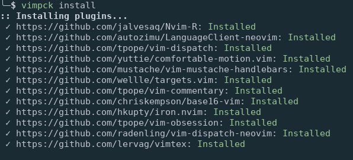

# Vim Pck

[](https://travis-ci.org/nicodebo/vim-pck)

A command-line tool to manage my vim plugins using the built-in package
feature of vim8. (see :help packages)




## Dependencies

* git
* python 3.6

## Installation

I like to install python command line programs in their own virtual environment
to not clutter the system wide package directory. `pipsi` make it very
conveniant to do so by automatically creating the venv and symlinking scripts
to `~/.local/bin`. If you don't use `pipsi`, you're missing out. Here are
[installation instructions](https://github.com/mitsuhiko/pipsi#readme).

Simply run:

`$ pipsi install git+https://github.com/nicodebo/vim-pck.git@master#egg=vimpck`

If your default python point to python2 you might have to specify the python
interpreter to use (not tested):

`$ pipsi install --python python3 git+https://github.com/nicodebo/vim-pck.git@master#egg=vimpck`

To update:

`$ pipsi uninstall vimpck`

`$ pipsi install git+https://github.com/nicodebo/vim-pck.git@master#egg=vimpck`

To uninstall:

`$ pipsi uninstall vimpck`

## How to use

### Configuration file

The main configuration file where the vim packages are
specified. It's default location follow the [XDG specification](https://specifications.freedesktop.org/basedir-spec/basedir-spec-latest.html) that is `$XDG_HOME_CONFIG/vimpck/config` or `~/.config/vimpck/config` if `XDG_HOME_CONFIG` is not set.

```dosini
; example vimpck configuration file
[DEFAULT]
;The built in package directory. See :help packages
pack_path=~/.vim/pack
;pack_path= ~/.local/share/nvim/site/pack for neovim

[https://github.com/tpope/vim-commentary]
package = common
type = start
freeze = True ;Don't update vim-commentary when launching vimpck upgrade

[https://github.com/tpope/vim-dispatch]
package = common
type = opt

[https://github.com/mustache/vim-mustache-handlebars]
package = filetype
type = start

[https://github.com/altercation/vim-colors-solarized]
package = colors
type = start
```

Then run `vimpck install` to clone each remote repository in the correct
package location. For exemple, `vim-commentary` -->
`~/.vim/pack/common/start/vim-commentary`

For neovim the package path should be set to `~/.local/share/nvim/site/pack`

### Usage

To use it (see `vimpck --help`):

* `$ vimpck install` : install plugins from the configuration file
* `$ vimpck ls` : list all plugins
* `$ vimpck ls --start` : list plugins that are automatically loaded
* `$ vimpck ls --opt` : list plugins that have to be loaded manually
* `$ vimpck update` : update all plugins that are not freezed
* `$ vimpck update <plug1>...` : only update `<plug1>` plugin. The plugin have
  to be specified using the following pattern `package/type/plugin`


### Environement variable

* `VIMPCKRC`: override default configuration location (xdg standard)

   example : `export VIMPCKRC=/path/to/conf/name`

### Completion

A zsh completion function is provided in the `completion` folder of this
repository.

To use it copy `_vimpck` somewhere in the `$fpath` environement variable of zsh
and make sure the completion module of zsh is loaded by putting these following
lines in your `.zshrc`:

```bash
autoload -U compinit
compinit
```

## TODO

- [x] vimpck install, install plugins from configuration file
- [ ] vimpck install -r <requirements>, restore a package directory. The
      requirements file comes from the vimpack freeze command herebelow.
- [x] vimpck list, list installed plugins
- [x] vimpck list --start, list autostarting plugins
- [x] vimpck list --opt, list optional plugins
- [x] vimpck upgrade, upgrade non freezed plugins
- [x] vimpck upgrade <plugin>, upgrade a specific plugin
- [ ] use sqlite to store package info (installation date, last upgrade,
      current commit, description,…) ?
- [ ] vimpck sync, search for upgrade and display the new commits
- [ ] vimpck freeze, generate a configuration file that mirrors the current
  packages installation (directory, commit)
- [ ] vimpck clean, remove commented out/location changed plugins
- [ ] find a better way to update vimpck. (pypi repo ?)
- [ ] Add post install hooks, (ex: generate documentation)
- [ ] Add a flag to upgrade cmd, to upgrade by package

## Related projects

* [minpac](https://github.com/k-takata/minpac): vim plugin
* [infect](https://github.com/csexton/infect): command-line tool build in ruby.
* [pack](https://github.com/maralla/pack): command-line tool build in rust.
* [vim8-pack](https://github.com/mkarpoff/vim8-pack): command-line tool in
  bash.

## Note

* Project generated with
  [cookiecutter-python-cli](https://github.com/nvie/cookiecutter-python-cli)
