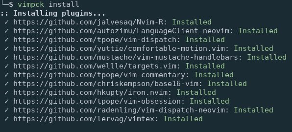
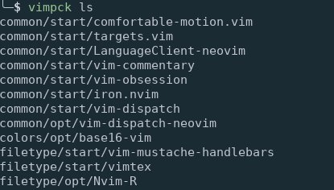
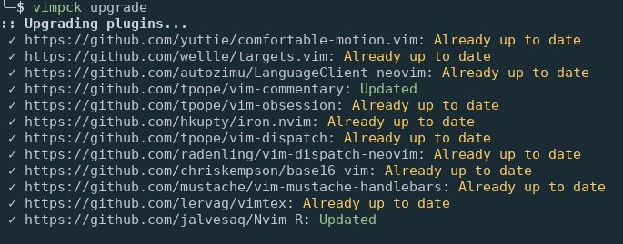

Vim Pck
=======

|Build Status| |Coverage Status| |Pypi|

A command-line tool to manage my vim plugins using the built-in package
feature of vim8. (see :help packages)

|install| |list| |upgrade|

Table of contents:
 * `Dependencies`_;
 * `Installation`_;
 * `How to use`_;
 * `Related projects`_;
 * `Note`_;
 * `License`_.

Dependencies
------------

-  git
-  python 3.6

Installation
------------

I like to install python command line programs in their own virtual
environment to not clutter the system wide package directory. ``pipsi``
make it very conveniant to do so by automatically creating the venv and
symlinking scripts to ``~/.local/bin``. If you don't use ``pipsi``,
you're missing out. Here are `installation
instructions <https://github.com/mitsuhiko/pipsi#readme>`_.

Simply run:

.. code:: shell

    $ pipsi install vim-pck

Alternatively, with pip:

.. code:: shell

    $ pip install vim-pck

How to use
----------

Configuration file
~~~~~~~~~~~~~~~~~~

The main configuration file where the vim packages are specified. It's
default location follow the `XDG specification <https://specifications.freedesktop.org/basedir-spec/basedir-spec-latest.html>`_
that is ``$XDG_HOME_CONFIG/vimpck/config`` or
``~/.config/vimpck/config`` if ``XDG_HOME_CONFIG`` is not set.

.. code:: dosini

    [SETTING]
        # The built in package directory. See :help packages
        pack_path=~/.vim/pack
        # pack_path= ~/.local/share/nvim/site/pack for neovim

    [REPOSITORY]
        [[https://github.com/tpope/vim-commentary]]
            package = common
            type = start
            freeze = True # Don't update vim-commentary when launching vimpck upgrade

        [[https://github.com/tpope/vim-dispatch]]
        # default location pack_path/vimpck/start/vim-dispatch

        [[https://github.com/mustache/vim-mustache-handlebars]]
            package = filetype
            type = start

        [[https://github.com/altercation/vim-colors-solarized]]
            package = colors
            type = start

Then run ``vimpck install`` to clone each remote repository in the
correct package location. For exemple, ``vim-commentary`` -->
``~/.vim/pack/common/start/vim-commentary``

For neovim the package path should be set to
``~/.local/share/nvim/site/pack``

+--------------+-------------------+
| Option       | default value     |
+==============+===================+
| pack\_path   | ``~/.vim/pack``   |
+--------------+-------------------+
| package      | ``vimpck``        |
+--------------+-------------------+
| type         | ``start``         |
+--------------+-------------------+
| freeze       | ``False``         |
+--------------+-------------------+

Usage
~~~~~

To use it (see ``vimpck --help``):

-  ``$ vimpck install`` : install plugins from the configuration file
-  ``$ vimpck ls`` : list all plugins
-  ``$ vimpck ls --start`` : list plugins that are automatically loaded
-  ``$ vimpck ls --opt`` : list plugins that have to be loaded manually
-  ``$ vimpck upgrade`` : update all plugins that are not freezed
-  ``$ vimpck upgrade <plug>...`` : only update ``<plug>`` plugin. The
   plugin have to be specified using the following pattern
   ``package/type/plugin``. You can easily complete the ``<plug>`` with
   the zsh completion script.
-  ``vimpck rm <plug>...`` : remove one or more ``<plug>``. Support zsh
   completion.
-  ``vimpck rm -r <plug>...`` : remove one or more ``<plug>`` and also
   remove the corresponding section from the configuration file.
-  ``vimpck clean`` : remove unused plugins

Environment variable
~~~~~~~~~~~~~~~~~~~~

-  ``VIMPCKRC``: override default configuration location (xdg standard)

Example : ``export VIMPCKRC=/path/to/conf/name``

Completion
~~~~~~~~~~

A zsh completion function is provided in the ``completion`` folder of
this repository.

To use it copy ``_vimpck`` somewhere in the ``$fpath`` environment
variable of zsh and make sure the completion module of zsh is loaded by
putting these following lines in your ``.zshrc``:

.. code:: bash

    autoload -U compinit
    compinit

Related projects
----------------

-  `minpac <https://github.com/k-takata/minpac>`_: vim plugin
-  `infect <https://github.com/csexton/infect>`_: command-line tool
   build in ruby.
-  `pack <https://github.com/maralla/pack>`_: command-line tool build
   in rust.
-  `vim8-pack <https://github.com/mkarpoff/vim8-pack>`_: command-line
   tool in bash.

Note
----

-  Project generated with
   `cookiecutter-python-cli <https://github.com/nvie/cookiecutter-python-cli>`_

License
-------

MIT license, see the LICENSE file. You can use obfuscator in open source
projects and commercial products.

.. _Dependencies: #dependencies
.. _Installation: #installation
.. _How to use: #how-to-use
.. _Related projects: #related-projects
.. _Note: #note
.. _License: #license

.. |Build Status| image:: https://travis-ci.org/nicodebo/vim-pck.svg?branch=master
   :target: https://travis-ci.org/nicodebo/vim-pck
.. |Coverage Status| image:: https://coveralls.io/repos/github/nicodebo/vim-pck/badge.svg?branch=master
   :target: https://coveralls.io/github/nicodebo/vim-pck?branch=master

.. |Pypi| image:: https://img.shields.io/pypi/v/vim-pck.svg?style=flat
   :target: https://pypi.python.org/pypi/vim-pck
